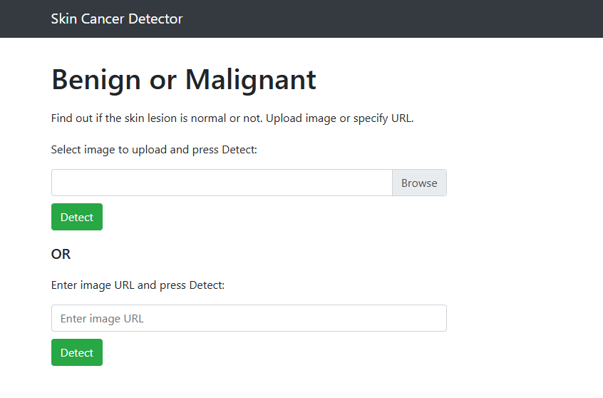
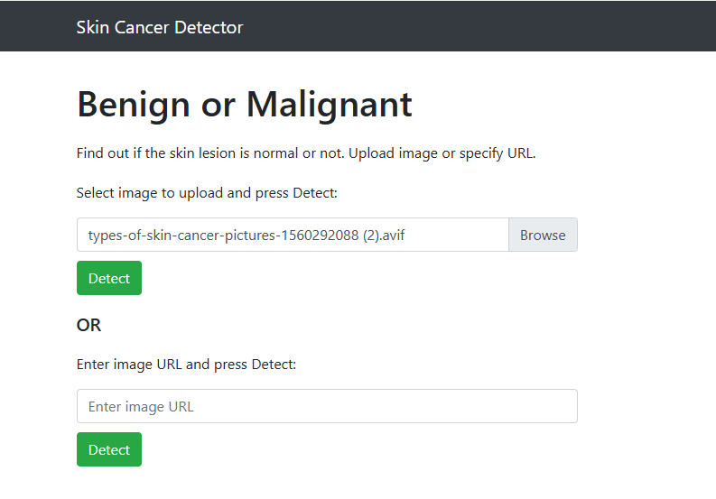
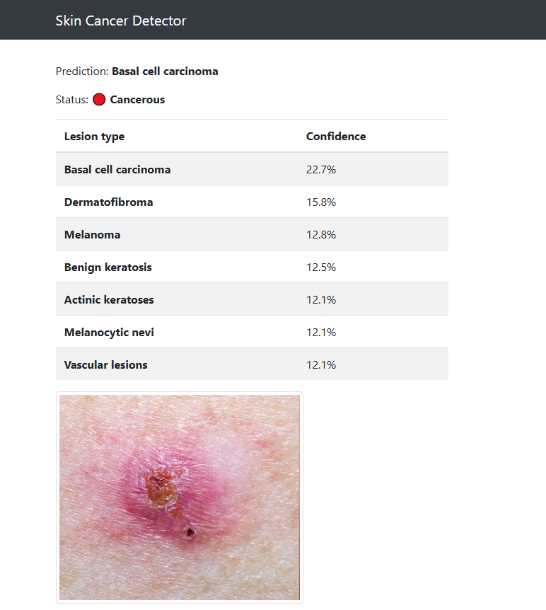

# 🩺 Skin Cancer Detection using Machine Learning and Web App


---

## 📌 Overview
This project is a machine learning-based web application that detects skin cancer from images. The system allows users to upload a skin image and get predictions using a trained deep learning model through a simple web interface.

---

## 📄 Abstract
Skin Cancer Detection using Machine Learning and Web App is a deep learning-based system that helps in identifying skin cancer from image inputs. The system uses a trained model to classify skin lesion images and provides prediction results through a web interface. It helps in early detection and awareness of skin cancer.

---

## 📖 Introduction
Skin cancer is one of the most common diseases worldwide. Early detection is very important for effective treatment. Manual diagnosis can be time-consuming and requires medical expertise. This project uses machine learning and deep learning techniques to build a system that can analyze skin lesion images and predict possible skin cancer types.

---

## 🎯 Aim
To develop a web-based application for detecting skin cancer using machine learning techniques.

---

## 📌 Objectives
- To classify skin lesion images using a trained model  
- To develop a simple web interface using Flask  
- To provide fast prediction results  
- To support early detection of skin cancer  

---

## 🌍 Project Scope
The system allows users to upload skin images and get prediction results instantly. It can be used for awareness and preliminary medical assistance.

---

## ⚙️ System Modules
- Image Upload Module  
- Image Processing Module  
- Prediction Module  
- Result Display Module  
- Web Interface Module  

---

## 🧠 Technologies Used

### Frontend
- HTML  
- CSS  
- JavaScript  

### Backend
- Python  
- Flask  
- Gunicorn  

### Machine Learning / Deep Learning
- PyTorch (torch==2.0.1)  
- TorchVision (0.15.2)  
- FastAI (1.0.52)  
- NumPy  

### Development Tools
- Jupyter Notebook  
- Visual Studio Code  

---

## 📂 Dataset
HAM10000 Dataset  
https://www.kaggle.com/kmader/skin-cancer-mnist-ham10000

---

## 📊 Model Training
The model was trained using dermoscopic skin lesion images from the HAM10000 dataset. Convolutional Neural Networks (CNN) with transfer learning were used for image classification.

---

## 📈 Results
- Successfully predicts skin lesion categories  
- Provides real-time prediction through web application  
- Helps improve awareness about early skin cancer detection  

---

## 🎯 Model Performance
- Accuracy: 91.2%  
- F1 Score: 91.7%  

---

## 🔄 Workflow
1. User uploads skin lesion image  
2. Image preprocessing is performed  
3. CNN model analyzes the image  
4. Prediction result is displayed  

---

## 🛠️ Installation

### Step 1: Clone Repository
```bash
git clone https://github.com/farzeenfathima313-cmyk/skin-cancer-detection-using-machine-learning-and-web-app.git
```

### Step 2: Move into Project Folder
```bash
cd skin-cancer-detection-using-machine-learning-and-web-app
```

### Step 3: Install required libraries
```bash
pip install -r requirements.txt
```

### Step 4: Run the project
```bash
python app.py
```

### Step 5: Open in browser
After running, you’ll see:
```
Running on http://127.0.0.1:5000/
```

Copy this link and open it in your browser.

## 📷 Screenshots

### 🏠 Home Page


### 📤 Upload Page


### 📊 Result Page


## 🔮 Future Scope
- Improve model accuracy using larger and more diverse datasets  
- Integrate advanced deep learning models for better prediction  
- Deploy the application on cloud platforms for public access  
- Develop a mobile application for easier usability  
- Add real-time doctor consultation feature  
- Enhance UI/UX for better user experience  
- Include multi-disease detection capabilities

  ## 👩‍💻 Author
**Farzeen Fathima**  
BCA (Data Science & Big Data Analytics)  
Yenepoya Institute of Arts, Science, Commerce & Management  
